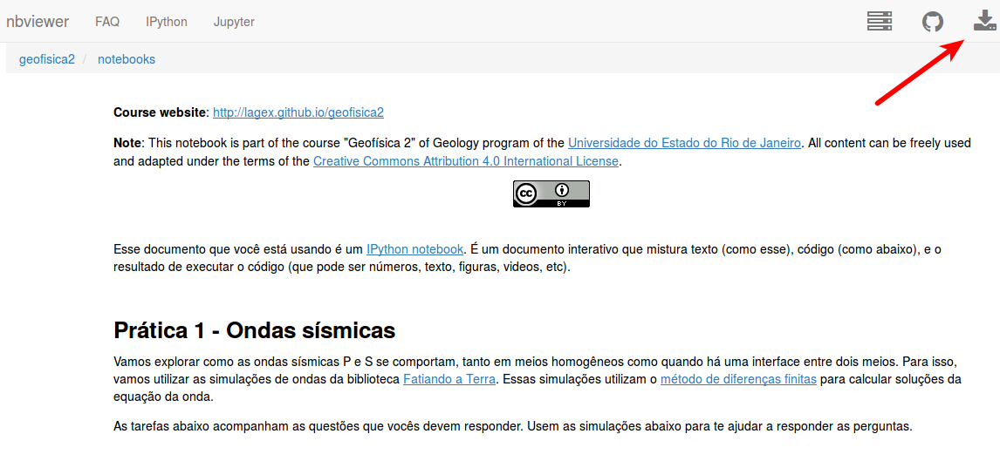

.. title:: Ondas sísmicas
.. _ondas:

Ondas sísmicas
=========================

Tópicos
-------

* Ondas elásticas
* Reflexão e transmissão de ondas
* Conversão de ondas em uma interface

Questionário
------------

.. raw:: html

    <ul class="fa-ul">
    <li><i class="fa-li fa fa-file-text-o fa-fw"></i>
    Veja no <a href="https://docs.google.com/document/d/1IsIyfbxbjKNiKPYMNWebqh67yzP9R4EOD-vWhZdeQ4s/pub">Google Drive</a>
    </li>
    <li><i class="fa-li fa fa-file-pdf-o fa-fw"></i>
    Baixe como PDF: <a href="_static/pdf/1-ondas-sismicas.pdf">1-ondas-sismicas.pdf</a>
    </li>
    <li><i class="fa-li fa fa-code fa-fw"></i>
    Baixe IPython notebook: <a href="http://nbviewer.ipython.org/github/lagex/geofisica2/blob/master/notebooks/ondas-sismicas.ipynb">ondas-sismicas.ipynb</a>
    </li>
    </ul>

Notebook
--------

O questionário possui um IPython notebook com código interativo para ajudar nas
questões. Rode o notebook enquanto responde as perguntas, explore o código,
busque as respostas nos exemplos do notebook.

.. raw:: html

    

    O link acima te levará para uma versão não-interativa do notebook. Baixe o
    notebook clicando no ícone <i class="fa fa-download"></i>.
    

