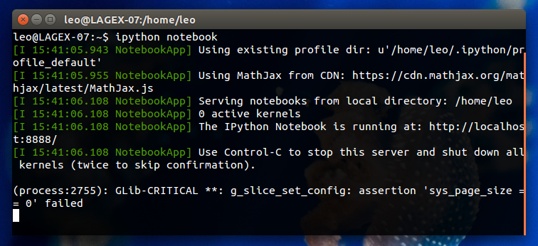

.. title:: Ondas de superfície
.. _ondas-superficie:

Prática 3: Ondas de superfície
==============================

.. raw:: html

    

    

    <h2>Tópicos</h2>

* Sismogramas de componentes
* Chegadas de ondas P e S
* Ondas de superfície: Love e Rayleigh
* Condições para surgimento de ondas de superfície
* Dispersão de ondas de superfície

.. raw:: html

    <h2>Questionário</h2>

    <ul class="fa-ul">
    <li><i class="fa-li fa fa-file-text-o fa-fw"></i>
    Veja as questões no <a
    href="https://docs.google.com/document/d/16390BOMGWZn8q0_7HCL1Cm5qdwbdLfXfpUOjYvK1QX4/pub">Google Drive</a>
    </li>
    <li><i class="fa-li fa fa-file-pdf-o fa-fw"></i>
    Baixe como PDF: <a href="../_static/pdf/3-ondas-de-superficie.pdf">3-ondas-de-superficie.pdf</a>
    </li>
    </ul>

.. raw:: html

    

    

    <h2>IPython notebook</h2>

    <ul class="fa-ul">
    <li><i class="fa-li fa fa-code fa-fw"></i>
    Veja o notebook online: <a href="http://nbviewer.ipython.org/github/lagex/geofisica2/blob/master/notebooks/ondas-superficie.ipynb">ondas-superficie.ipynb</a>
    </li>
    <li><i class="fa-li fa fa-download fa-fw"></i>
    Baixe o notebook:
    <a href="https://raw.githubusercontent.com/lagex/geofisica2/master/notebooks/ondas-superficie.ipynb">ondas-superficie.ipynb</a>
    </li>
    </ul>

O questionário possui um IPython notebook com código interativo para ajudar nas
questões. O notebook é **complementar ao questionário**. Use-o para entender
melhor as perguntas e achar as respostas.

**Baixe o notebook** para seu computador para poder executá-lo.
Para rodar o notebook, abra um terminal
e digite ``ipython notebook`` (e aperte "enter").

.. raw:: html

    

    

